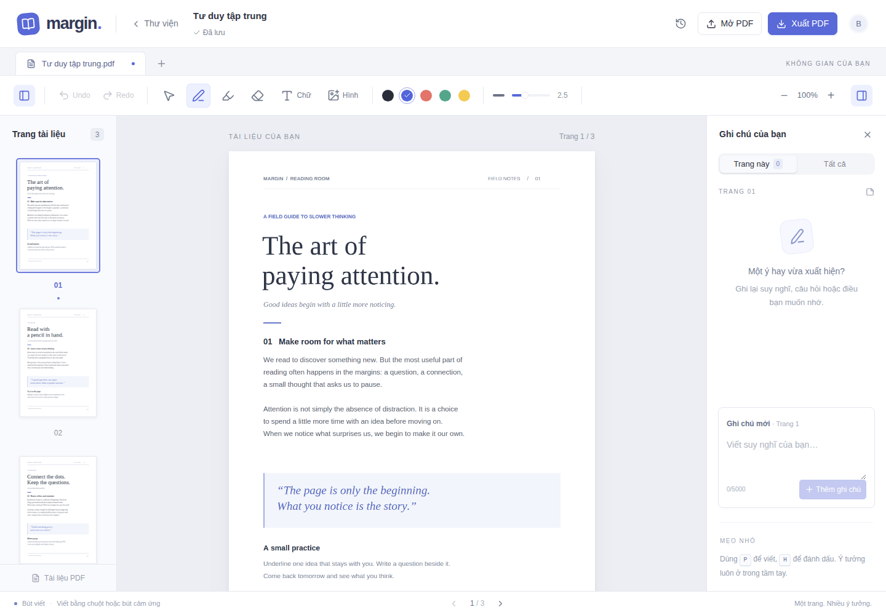

# 01 — Bắt đầu và không gian đọc

[← Mục lục](README.md) · [Tiếp: Thư viện →](02-thu-vien.md)

## 1. Mở PDF

1. Vào website ở cổng **3002**.
2. Bấm **Mở PDF** ở góc trên bên phải hoặc **Thêm PDF** trong thư viện.
3. Chọn file trên máy. Website hỗ trợ PDF tối đa **25 MB, 100 trang**.
4. Đợi tài liệu hiển thị. File được lưu vào thư viện để mở lại sau này.

Bạn cũng có thể kéo thả file PDF vào vùng đọc. PDF có mật khẩu hiện chưa có luồng nhập mật khẩu; hãy mở khóa file trước khi tải lên.

## 2. Các vùng trên màn hình

- **Trên cùng:** tên tài liệu, trạng thái lưu, lịch sử của PDF đang mở, Mở PDF và Xuất PDF.
- **Thanh công cụ:** ẩn/hiện danh sách trang, Undo/Redo, di chuyển, bút, highlight, tẩy, chữ, hình, màu nét, độ dày và zoom. Một số công cụ xuống dòng hoặc ẩn khi màn hình hẹp.
- **Bên trái:** ảnh thu nhỏ của các trang. Bấm một ảnh để chuyển trang.
- **Ở giữa:** trang PDF và các nét/chữ/hình bạn chèn.
- **Bên phải:** ghi chú văn bản, có tab Trang này và Tất cả. “Tất cả” ở đây là toàn bộ ghi chú **trong PDF đang mở**.
- **Dưới cùng:** công cụ đang dùng và nút chuyển trang.

## 3. Điều hướng

- Chuyển trang bằng ảnh thu nhỏ bên trái hoặc nút mũi tên ở dưới.
- Khi không nhập chữ, phím `←` / `→` chuyển trang. Nếu đang chọn hộp chữ/hình, các phím này di chuyển đối tượng đó.
- Dùng `−` / `+` cạnh phần trăm zoom để thu/phóng. Bấm con số zoom để về **100%**.
- Chọn **Di chuyển (V)** rồi kéo trang để cuộn vùng đọc.
- Hai nút hình bảng ở thanh công cụ dùng để ẩn/hiện danh sách trang và ghi chú.

## 4. Kiểm tra đã lưu

Trạng thái gần tên tài liệu chuyển từ **Đang lưu…** sang **Đã lưu** sau khi chỉnh sửa.

Nếu thấy **Chưa lưu** hoặc thông báo lỗi, bấm **Thử lại** và giữ trang mở. Không xóa dữ liệu server khi muốn giữ PDF và ghi chú.
