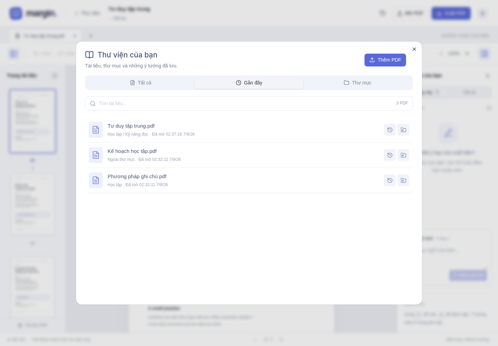
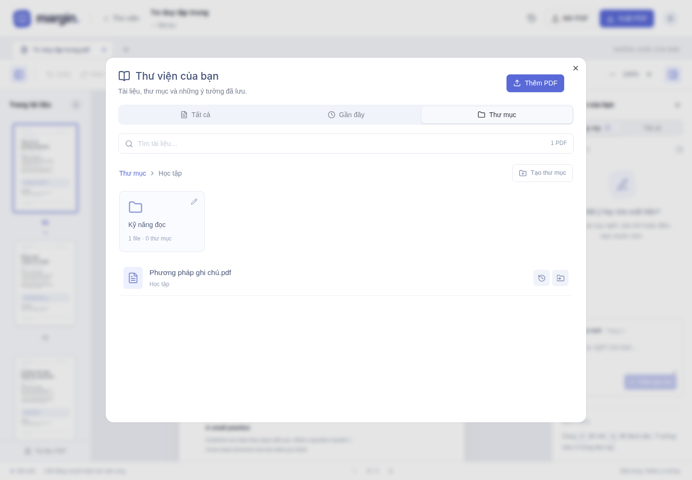
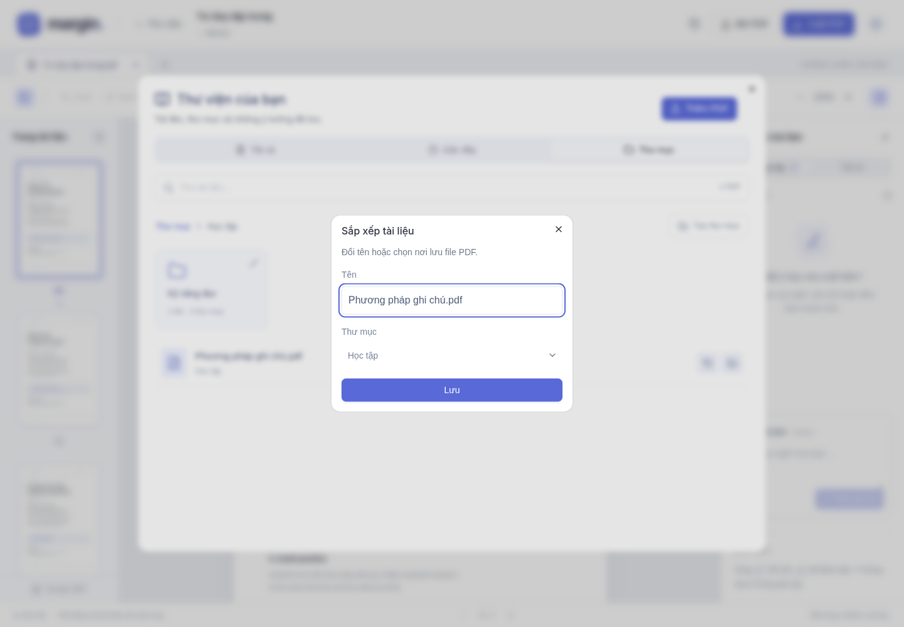

# 02 — Thư viện, thư mục và Gần đây

[← Mục lục](README.md) · [Tiếp: Ghi chú →](03-ghi-chu.md)

## 1. Mở thư viện

Bấm logo **margin** hoặc **Thư viện** ở phía trên. Có ba mục: **Tất cả**, **Gần đây**, **Thư mục**.

Nhập tên vào ô tìm kiếm để lọc các PDF trong mục đang xem. Bấm tên file để mở.

## 2. Xem các PDF vừa mở

Chọn **Gần đây**. File mở gần nhất đứng đầu. Danh sách được lưu phía server và vẫn còn khi tải lại website.

## 3. Tạo thư mục và thư mục con

1. Chọn **Thư mục**.
2. Bấm **Tạo thư mục**, nhập tên rồi **Lưu**.
3. Muốn tạo thư mục con, mở thư mục cha trước rồi bấm **Tạo thư mục**.
4. Dùng đường dẫn phía trên danh sách để quay về thư mục cha hoặc gốc.

Để đổi tên thư mục, bấm biểu tượng **bút chì** trên ô thư mục.

## 4. Thêm hoặc chuyển PDF vào thư mục

- **File mới:** mở thư mục đích rồi bấm **Thêm PDF**.
- **File đã có:** bấm biểu tượng **chuyển thư mục** ở bên phải dòng file; trong hộp **Sắp xếp tài liệu**, chọn thư mục đích rồi **Lưu**.
- Cũng trong hộp này, sửa trường **Tên** để đổi tên PDF.
- Chọn **Ngoài thư mục** để đưa file về thư mục gốc.

Tài liệu mẫu có sẵn dùng để trải nghiệm; thao tác đổi tên/chuyển thư mục áp dụng cho PDF bạn tải lên.

## 5. Mở lịch sử của một file

Bấm biểu tượng **đồng hồ/mũi tên lịch sử** cạnh đúng file PDF. Màn hình hiện tên PDF đó và chỉ các phiên bản của file đó.

Không có lịch sử chung của toàn thư viện. Xem [hướng dẫn khôi phục phiên bản](04-lich-su-va-xuat.md).
