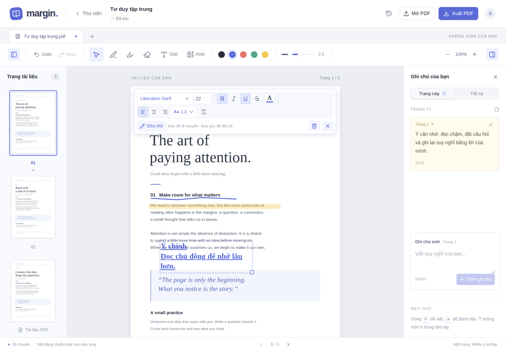

# 03 — Ghi chú, chữ và hình trên PDF

[← Mục lục](README.md) · [Tiếp: Lịch sử và xuất PDF →](04-lich-su-va-xuat.md)

## 1. Viết tay và highlight

1. Chọn **Bút viết (P)** hoặc **Đánh dấu (H)**.
2. Chọn màu nét. Trên màn hình đủ rộng, có thể chỉnh độ dày bằng thanh trượt.
3. Kéo chuột hoặc bút cảm ứng trên trang để vẽ.
4. Chọn **Tẩy nét (E)** và kéo qua nét cần xóa. Tẩy xóa cả nét vẽ bị chạm.

Khi highlight với màu xanh mặc định, nét đánh dấu dùng màu vàng. Bạn có thể chọn các màu khác trên thanh màu.

## 2. Ghi chú văn bản bên cạnh tài liệu

1. Mở bảng **Ghi chú của bạn** bên phải.
2. Nhập nội dung ở ô **Ghi chú mới**.
3. Bấm **Thêm ghi chú**. Ghi chú gắn với trang đang đọc.
4. Tab **Trang này** chỉ hiện ghi chú của trang hiện tại; **Tất cả** hiện ghi chú của toàn PDF này.

Bấm số trang trên một ghi chú để tới trang đó. Bấm dấu `×` trên ghi chú để xóa; có thể Undo ngay sau đó.

## 3. Chèn chữ với thanh định dạng như Word

1. Bấm **Chữ (T)**.
2. Bấm vị trí muốn đặt chữ trên trang PDF.
3. Nhập nội dung trong hộp soạn thảo.
4. Dùng thanh định dạng để chọn font, cỡ chữ, màu, B/I/U, gạch ngang, căn lề và giãn dòng.
5. Bấm **Chèn chữ**.

| Công cụ | Công dụng |
| --- | --- |
| Danh sách font | Liberation Sans, Liberation Serif, Liberation Mono hoặc Arial |
| Ô số | Cỡ chữ từ 8 đến 120; nhấn Enter hoặc rời ô để áp dụng |
| **B** / *I* / U | Đậm / nghiêng / gạch chân |
| Gạch ngang | Kẻ ngang giữa dòng chữ |
| Chữ A có vạch màu | Chọn màu chữ |
| Ba nút căn lề | Căn trái, giữa hoặc phải trong hộp chữ |
| Giãn dòng | Điều chỉnh khoảng cách giữa các dòng |
| Xóa định dạng | Trở về kiểu chữ mặc định |

**Định dạng áp dụng cho toàn bộ hộp chữ**, chưa áp dụng riêng cho một từ được bôi chọn. Muốn nhiều kiểu khác nhau, tạo các hộp chữ riêng.

## 4. Chỉnh lại chữ trên trang

Chọn **Di chuyển (V)** rồi bấm hộp chữ. Thanh định dạng hiện phía trên trang để chỉnh trực tiếp. Bấm **Sửa chữ** hoặc nhấp đúp vào hộp để sửa nội dung.

- Kéo hộp chữ để đổi vị trí.
- Kéo góc dưới bên phải để đổi chiều rộng; chữ tự xuống dòng.
- Dùng các phím mũi tên để dịch chuyển đối tượng đang được chọn. Giữ Shift để dịch chuyển xa hơn.
- Bấm thùng rác hoặc Delete/Backspace để xóa đối tượng đã chọn.

## 5. Chèn hình

1. Bấm **Hình** trên thanh công cụ.
2. Chọn ảnh **PNG, JPG hoặc WebP** nhỏ hơn 20 MB.
3. Đợi ảnh xuất hiện trên trang. Website thu nhỏ ảnh lớn trước khi lưu; nếu vẫn quá nặng, hãy chọn ảnh nhỏ hơn.
4. Kéo ảnh để di chuyển; kéo góc để đổi kích thước và giữ tỉ lệ.

Dùng công cụ Di chuyển (V) để chọn lại ảnh. Nút tẩy nét dùng cho nét vẽ; muốn xóa chữ/hình, chọn đối tượng rồi bấm thùng rác hoặc Delete.

## 6. Undo/Redo và phím tắt

| Phím | Thao tác |
| --- | --- |
| V / P / H / E / T | Di chuyển / bút / highlight / tẩy / thêm chữ |
| Ctrl+Z | Undo — hoàn tác |
| Ctrl+Shift+Z hoặc Ctrl+Y | Redo — làm lại |
| Ctrl+B / Ctrl+I / Ctrl+U | Đậm / nghiêng / gạch chân khi sửa hoặc chọn hộp chữ |
| Enter | Mở sửa nội dung khi đang chọn hộp chữ |
| Escape | Bỏ chọn đối tượng |

Trên macOS, thay Ctrl bằng Cmd. Undo/Redo cũng có nút trên thanh công cụ.

Undo/Redo áp dụng cho phiên mở tài liệu hiện tại. Sau khi mở lại file hoặc tải lại trang, dùng **Lịch sử của PDF** để quay về các bản đã lưu.
