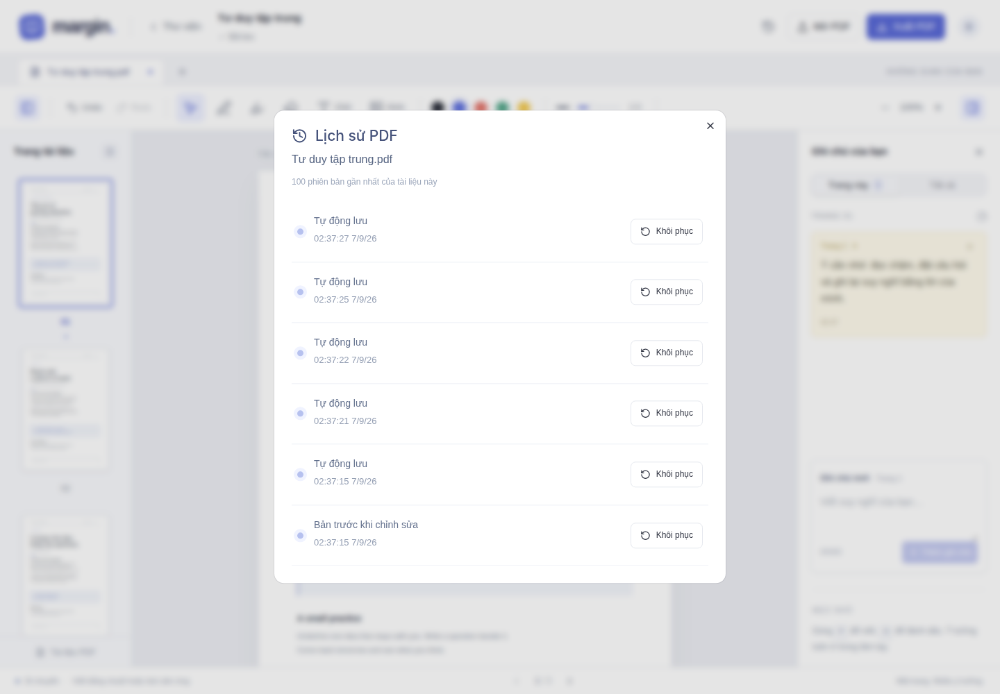
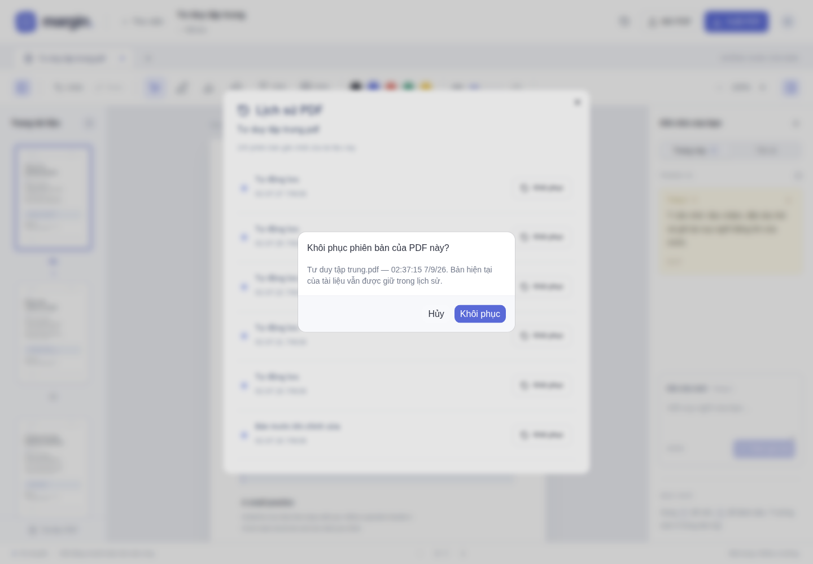

# 04 — Lịch sử từng PDF và xuất tài liệu

[← Mục lục](README.md)

## 1. Mở lịch sử đúng file PDF

Có hai cách:

- Trong trình đọc, bấm nút **Lịch sử phiên bản** gần các nút Mở PDF / Xuất PDF. Đây là lịch sử của PDF đang mở.
- Trong thư viện, bấm biểu tượng lịch sử ở bên phải dòng file cần xem.

Tên PDF nằm ngay dưới tiêu đề **Lịch sử PDF**. Danh sách chỉ chứa phiên bản của file đó; không gộp các PDF khác.

Các loại phiên bản:

- **Bản trước khi chỉnh sửa:** trạng thái ban đầu được giữ lại.
- **Tự động lưu:** phiên bản được tạo khi lưu thay đổi.
- **Đã khôi phục phiên bản:** mốc mới sau một lần khôi phục.

Giao diện hiển thị 100 phiên bản gần nhất của PDF. Với tài liệu có trước tính năng lịch sử, bản trước đó được giữ lại khi bạn tiếp tục chỉnh sửa.

## 2. Khôi phục phiên bản

1. Chọn phiên bản theo thời gian rồi bấm **Khôi phục**.
2. Kiểm tra tên file và thời điểm trong hộp xác nhận.
3. Bấm **Khôi phục** để áp dụng hoặc **Hủy** để giữ nguyên.

Ghi chú, nét vẽ, chữ và hình của PDF đó trở về phiên bản đã chọn. Bản hiện tại vẫn được giữ trong lịch sử. Những PDF khác không bị thay đổi.

## 3. Xuất PDF đã ghi chú

1. Kiểm tra tài liệu đang mở và đợi **Đã lưu**.
2. Bấm **Xuất PDF** ở góc trên bên phải.
3. Chờ quá trình xuất kết thúc và lấy file tải xuống từ trình duyệt.

Tên file xuất có hậu tố `-ghi-chu.pdf`. File bao gồm:

- Các trang PDF và nét viết/highlight.
- Chữ với định dạng đã chọn và hình đã chèn.
- Ghi chú văn bản ở bảng bên phải được nối thành các trang cuối.

Bản xuất được làm phẳng thành ảnh để giữ vị trí nội dung, nên không giữ lớp chữ có thể bôi chọn của PDF gốc. PDF gốc trong thư viện không bị ghi đè.

## 4. Khi gặp vấn đề

| Hiện tượng | Cách xử lý |
| --- | --- |
| Không vào được bằng Tailscale | Kiểm tra cả hai thiết bị đã kết nối cùng tailnet; dùng đúng `http://<IP>:3002` |
| Không thấy file | Xem Tất cả, xóa từ khóa tìm kiếm hoặc kiểm tra thư mục khác |
| Không thấy thay đổi giao diện mới | Đợi Đã lưu rồi tải lại trang |
| Không vẽ được | Chọn Bút viết (P), thay vì công cụ Di chuyển (V) |
| Không xóa được chữ/hình bằng tẩy | Chọn đối tượng bằng V rồi bấm thùng rác hoặc Delete |
| Chưa có lịch sử | Tạo một chỉnh sửa và đợi tự lưu; lịch sử thuộc từng PDF |
| Có thông báo Chưa lưu | Giữ trang mở, kiểm tra kết nối rồi bấm Thử lại |
